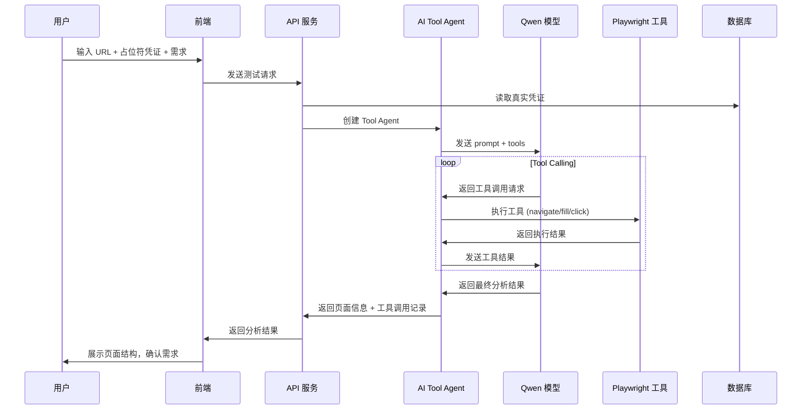

# AI Agent 驱动的测试流程 - 设计文档

## Overview

本设计文档描述了 AI Agent 驱动的测试流程的技术实现方案。核心思想是使用 Vercel AI SDK 的 Tool Calling 功能，让 AI 模型（Qwen）自动识别并调用 Playwright 工具，实现真正的页面访问、登录、内容获取和测试执行。

### 核心技术栈

- **Vercel AI SDK**: 提供 `generateText` 函数和 `tool` 定义
- **qwen-ai-provider**: 阿里云千问模型的 Provider，支持 Tool Calling
- **Playwright MCP**: 浏览器自动化工具
- **Zod**: 工具参数验证

### 流程图



## Architecture

### 系统架构

```
┌─────────────────────────────────────────────────────────────┐
│                        Frontend                              │
│  ┌─────────────┐  ┌─────────────┐  ┌─────────────────────┐  │
│  │ TestConfig  │  │ ChatPanel   │  │ ExecutionMonitor    │  │
│  │ Form        │  │             │  │                     │  │
│  └─────────────┘  └─────────────┘  └─────────────────────┘  │
└─────────────────────────────────────────────────────────────┘
                              │
                              ▼
┌─────────────────────────────────────────────────────────────┐
│                      API Layer                               │
│  ┌─────────────┐  ┌─────────────┐  ┌─────────────────────┐  │
│  │ /api/test/  │  │ /api/test/  │  │ /api/test/          │  │
│  │ agent-      │  │ generate    │  │ execute             │  │
│  │ analyze     │  │             │  │                     │  │
│  └─────────────┘  └─────────────┘  └─────────────────────┘  │
└─────────────────────────────────────────────────────────────┘
                              │
                              ▼
┌─────────────────────────────────────────────────────────────┐
│                    AI Tool Agent                             │
│  ┌─────────────────────────────────────────────────────┐    │
│  │                 AIToolAgent                          │    │
│  │  ┌───────────┐  ┌───────────┐  ┌───────────────┐    │    │
│  │  │ Qwen      │  │ Tool      │  │ MCP           │    │    │
│  │  │ Provider  │  │ Definitions│  │ Executor      │    │    │
│  │  └───────────┘  └───────────┘  └───────────────┘    │    │
│  └─────────────────────────────────────────────────────┘    │
└─────────────────────────────────────────────────────────────┘
                              │
                              ▼
┌─────────────────────────────────────────────────────────────┐
│                   Playwright Tools                           │
│  ┌─────────┐ ┌─────────┐ ┌─────────┐ ┌─────────┐ ┌───────┐  │
│  │navigate │ │ fill    │ │ click   │ │evaluate │ │screen │  │
│  │         │ │         │ │         │ │         │ │shot   │  │
│  └─────────┘ └─────────┘ └─────────┘ └─────────┘ └───────┘  │
└─────────────────────────────────────────────────────────────┘
```

### 模块职责

| 模块 | 职责 |
|------|------|
| AIToolAgent | 封装 Vercel AI SDK 的 Tool Calling 功能 |
| QwenProvider | 创建和配置 Qwen 模型实例 |
| ToolDefinitions | 定义 Playwright 工具的参数和执行逻辑 |
| MCPExecutor | 实际执行 Playwright MCP 工具调用 |
| CredentialService | 管理凭证的加密存储和解密读取 |

## Components and Interfaces

### AIToolAgent 类

```typescript
interface ToolAgentConfig {
  purpose?: ModelPurpose      // 模型用途场景
  mcpExecutor?: MCPExecutor   // MCP 工具执行器
  maxSteps?: number           // 最大工具调用步数
}

interface ToolAgentResult {
  text: string                // AI 返回的文本
  toolCalls: Array<{          // 工具调用记录
    toolName: string
    args: any
    result: any
  }>
  pageInfo?: PageInfo         // 提取的页面信息
}

class AIToolAgent {
  constructor(config: ToolAgentConfig)
  setMCPExecutor(executor: MCPExecutor): void
  executeWithTools(prompt: string, systemPrompt?: string): Promise<ToolAgentResult>
  visitAndAnalyze(url: string, requirements?: string): Promise<ToolAgentResult>
  loginAndNavigate(loginUrl: string, credentials: Credentials, targetMenu?: string): Promise<ToolAgentResult>
}
```

### MCPExecutor 接口

```typescript
interface MCPExecutor {
  navigate(url: string): Promise<void>
  fill(selector: string, value: string): Promise<void>
  click(selector: string): Promise<void>
  getVisibleHtml(): Promise<string>
  getVisibleText(): Promise<string>
  evaluate(script: string): Promise<any>
  screenshot(name: string): Promise<string>
}
```

### CredentialService 接口

```typescript
interface CredentialService {
  // 加密存储凭证
  saveCredentials(domainId: string, credentials: Credentials): Promise<void>
  // 读取并解密凭证
  getCredentials(domainId: string): Promise<Credentials | null>
  // 清除凭证
  clearCredentials(domainId: string): Promise<void>
  // 获取掩码凭证（用于前端显示）
  getMaskedCredentials(domainId: string): Promise<MaskedCredentials>
}
```

### 工具定义

```typescript
const playwrightTools = {
  navigate: tool({
    description: '导航到指定的 URL 地址',
    parameters: z.object({
      url: z.string().describe('要访问的 URL 地址'),
    }),
    execute: async ({ url }) => { /* ... */ },
  }),
  
  fill: tool({
    description: '在输入框中填写内容',
    parameters: z.object({
      selector: z.string().describe('CSS 选择器'),
      value: z.string().describe('要填写的内容'),
    }),
    execute: async ({ selector, value }) => { /* ... */ },
  }),
  
  click: tool({
    description: '点击页面上的元素',
    parameters: z.object({
      selector: z.string().describe('CSS 选择器'),
    }),
    execute: async ({ selector }) => { /* ... */ },
  }),
  
  // ... 其他工具
}
```

## Data Models

### PageInfo 结构

```typescript
interface PageInfo {
  url: string
  title: string
  html: string
  text: string
  forms: Array<{
    inputs: Array<{
      name?: string
      type?: string
      placeholder?: string
      id?: string
    }>
    buttons: Array<{
      text?: string
      type?: string
      id?: string
    }>
  }>
  buttons: Array<{
    text?: string
    id?: string
    className?: string
  }>
  menus: Array<{
    text?: string
    href?: string
  }>
  tables: Array<{
    headers: string[]
    rowCount: number
  }>
}
```

### ToolCallRecord 结构

```typescript
interface ToolCallRecord {
  id: string
  toolName: string
  args: Record<string, any>
  result: any
  startTime: Date
  endTime: Date
  duration: number
  success: boolean
  error?: string
}
```

### Credentials 结构

```typescript
interface Credentials {
  username: string
  password: string
  usernameSelector?: string
  passwordSelector?: string
  submitSelector?: string
}

interface MaskedCredentials {
  username: string
  password: string  // 显示为 ******
  hasCredentials: boolean
}
```

## Correctness Properties

*A property is a characteristic or behavior that should hold true across all valid executions of a system-essentially, a formal statement about what the system should do. Properties serve as the bridge between human-readable specifications and machine-verifiable correctness guarantees.*

### Property 1: 页面访问工具调用序列

*For any* URL 访问请求，AI Agent 应按顺序调用 navigate -> getPageHtml/extractPageStructure 工具，且 navigate 的参数应包含正确的 URL。

**Validates: Requirements 1.1, 1.2, 1.3**

### Property 2: 凭证加密存储 Round-Trip

*For any* 凭证对象，存储后读取应返回与原始值相同的凭证（加密存储 -> 解密读取 = 原始值）。

**Validates: Requirements 2.1, 2.2**

### Property 3: 凭证掩码显示

*For any* 存储的凭证，获取掩码凭证时密码字段应被替换为占位符（如 ******），不应包含真实密码。

**Validates: Requirements 2.3**

### Property 4: 菜单导航工具调用

*For any* 菜单导航请求，AI Agent 应调用 click 工具，且调用次数应与菜单层级相匹配。

**Validates: Requirements 3.1, 3.2**

### Property 5: 测试用例选择器生成优先级

*For any* 页面元素，生成的选择器应遵循优先级规则：有 ID 时使用 #id，无 ID 有 name 时使用 [name="xxx"]，否则使用文本或位置选择器。

**Validates: Requirements 5.2, 5.3, 5.4**

### Property 6: 测试用例必须包含选择器和 actionType

*For any* 生成的测试步骤，应包含 selector 字段和 actionType 字段（click/fill/select/navigate/verify）。

**Validates: Requirements 5.1, 5.5**

### Property 7: 工具调用日志完整性

*For any* 工具调用，日志应包含工具名称、参数、调用时间、返回结果和耗时。

**Validates: Requirements 6.1, 6.2**

### Property 8: 测试执行器工具映射

*For any* 测试步骤，TestExecutor 应根据 actionType 调用对应的工具：click -> click 工具，fill -> fill 工具，verify -> evaluate 工具。

**Validates: Requirements 7.1, 7.2, 7.3, 7.4**

### Property 9: maxSteps 限制工具调用次数

*For any* 设置了 maxSteps 的 AI Agent 调用，工具调用总次数不应超过 maxSteps。

**Validates: Requirements 8.4**

### Property 10: 工具调用记录收集完整性

*For any* AI Agent 执行完成后，返回的 toolCalls 数组应包含所有执行过的工具调用记录。

**Validates: Requirements 8.5**

## Error Handling

### 工具调用失败处理

```typescript
// 工具执行失败时的处理策略
const toolExecutionStrategy = {
  // 必要操作：重试 3 次，失败则终止
  critical: {
    maxRetries: 3,
    onFailure: 'abort',
  },
  // 非必要操作：记录错误，继续执行
  optional: {
    maxRetries: 1,
    onFailure: 'continue',
  },
}
```

### 错误类型

| 错误类型 | 处理方式 |
|---------|---------|
| 网络错误 | 重试 3 次，失败后通知用户 |
| 元素未找到 | 记录错误，尝试替代选择器 |
| 登录失败 | 通知用户检查凭证 |
| 超时 | 重试 1 次，失败后继续 |
| AI 模型错误 | 切换备用模型或通知用户 |

## Testing Strategy

### 双重测试方法

本项目采用单元测试和属性测试相结合的方式：

- **单元测试**：验证具体示例和边界情况
- **属性测试**：验证通用属性在所有输入上成立

### 属性测试框架

使用 `fast-check` 作为属性测试库，配置每个属性测试运行至少 100 次迭代。

### 测试用例标注格式

每个属性测试必须使用以下格式标注：

```typescript
/**
 * **Feature: ai-agent-driven-testing, Property 1: 页面访问工具调用序列**
 * **Validates: Requirements 1.1, 1.2, 1.3**
 */
```

### 测试覆盖范围

| 模块 | 单元测试 | 属性测试 |
|------|---------|---------|
| AIToolAgent | ✓ | ✓ |
| CredentialService | ✓ | ✓ |
| ToolDefinitions | ✓ | - |
| MCPExecutor | ✓ | - |
| SelectorGenerator | ✓ | ✓ |

---

**文档版本**：1.0  
**最后更新**：2025-12-16  
**作者**：@Jiane
