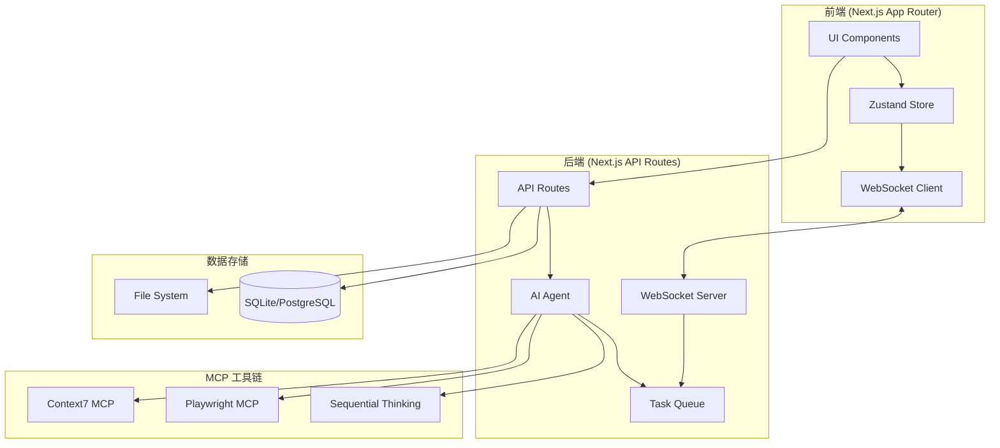

# AI 自动化测试平台 - 技术设计文档

## Overview

本文档描述 AI 自动化测试平台的技术架构设计，基于 Next.js 16 + Vercel AI SDK + MCP 工具链构建。平台支持多领域隔离管理，通过 AI 智能分析需求、生成测试用例、并发执行测试，并实时反馈执行进度和 Bug 信息。

### 核心设计目标
- **领域隔离**：每个测试项目完全独立，数据不串台
- **AI 驱动**：利用 MCP 工具链实现智能测试
- **实时交互**：WebSocket 推送执行状态，支持用户实时干预
- **并发执行**：支持 10 个测试任务并发执行

## Architecture

### 系统架构图



### 技术栈选型

| 层级 | 技术 | 说明 |
|------|------|------|
| 前端框架 | Next.js 16 (App Router) | 支持 RSC 和流式渲染 |
| UI 组件 | shadcn/ui + Tailwind CSS | 现代化组件库 |
| 状态管理 | Zustand | 轻量级状态管理 |
| 实时通信 | Socket.io | WebSocket 封装，支持断线重连 |
| AI 集成 | Vercel AI SDK | 统一的 AI 调用接口 |
| MCP 工具 | @modelcontextprotocol/* | 标准化工具调用 |
| 数据库 | SQLite (dev) / PostgreSQL (prod) | 关系型数据存储 |
| ORM | Drizzle ORM | 类型安全的数据库操作 |

## Components and Interfaces

### 1. 前端组件架构

```
src/components/
├── ui/                          # shadcn/ui 基础组件
│   ├── button.tsx
│   ├── input.tsx
│   ├── card.tsx
│   ├── progress.tsx
│   ├── dialog.tsx
│   └── ...
├── domains/                     # 领域管理组件
│   ├── DomainList.tsx          # 领域列表
│   ├── DomainCard.tsx          # 领域卡片
│   ├── CreateDomainDialog.tsx  # 创建领域弹窗
│   └── DeleteDomainDialog.tsx  # 删除确认弹窗
├── test-config/                 # 测试配置组件
│   ├── TestConfigForm.tsx      # 配置表单
│   ├── UrlInput.tsx            # URL 输入框
│   ├── CredentialsInput.tsx    # 凭证输入
│   └── RequirementsInput.tsx   # 需求输入
├── test-monitor/                # 测试监控组件
│   ├── ExecutionProgress.tsx   # 执行进度条
│   ├── TestCaseList.tsx        # 用例列表
│   ├── ExecutionLogs.tsx       # 执行日志
│   ├── BugList.tsx             # Bug 列表
│   └── TaskControls.tsx        # 任务控制按钮
├── interactive-chat/            # 聊天组件
│   ├── ChatContainer.tsx       # 聊天容器
│   ├── MessageList.tsx         # 消息列表
│   ├── MessageInput.tsx        # 消息输入
│   └── ChatMessage.tsx         # 单条消息
└── reports/                     # 报告组件
    ├── ReportSummary.tsx       # 报告摘要
    ├── BugReport.tsx           # Bug 报告
    ├── AcceptanceReport.tsx    # 验收报告
    └── RecommendationList.tsx  # 整改建议
```

### 2. API 路由设计

```typescript
// 领域管理 API
POST   /api/domains              // 创建领域
GET    /api/domains              // 获取领域列表
GET    /api/domains/[id]         // 获取单个领域
DELETE /api/domains/[id]         // 删除领域

// 测试项目 API
POST   /api/domains/[id]/projects        // 创建测试项目
GET    /api/domains/[id]/projects        // 获取项目列表
GET    /api/domains/[id]/projects/[pid]  // 获取单个项目

// 测试执行 API
POST   /api/test/analyze         // AI 需求分析
POST   /api/test/explore         // 网站探索
POST   /api/test/generate        // 生成用例
POST   /api/test/execute         // 执行测试
POST   /api/test/control         // 任务控制（暂停/继续/停止）

// 聊天 API
POST   /api/chat                 // 发送消息
GET    /api/chat/[domainId]      // 获取聊天历史

// 报告 API
GET    /api/reports/[domainId]   // 获取报告
POST   /api/reports/generate     // 生成报告
```

### 3. 核心服务接口

```typescript
// AI Agent 接口
interface IAIAgent {
  analyzeRequirements(requirements: string): Promise<AnalysisResult>
  exploreWebsite(url: string, credentials?: Credentials): Promise<ExplorationResult>
  generateTestCases(analysis: AnalysisResult, exploration: ExplorationResult): Promise<TestCase[]>
  updateTestCases(cases: TestCase[], feedback: string): Promise<TestCase[]>
  executeTestCase(testCase: TestCase, context: BrowserContext): Promise<TestResult>
  generateReport(results: TestResult[]): Promise<TestReport>
}

// 任务队列接口
interface ITaskQueue {
  enqueue(task: TestTask): void
  dequeue(): TestTask | undefined
  getRunningCount(): number
  getQueuedTasks(): TestTask[]
  pauseTask(taskId: string): void
  resumeTask(taskId: string): void
  cancelTask(taskId: string): void
}

// WebSocket 服务接口
interface IWebSocketService {
  broadcast(domainId: string, event: string, data: unknown): void
  sendToClient(clientId: string, event: string, data: unknown): void
  onConnection(handler: (socket: Socket) => void): void
}

// 存储服务接口
interface IStorageService {
  // Domain CRUD
  createDomain(data: CreateDomainInput): Promise<Domain>
  getDomains(): Promise<Domain[]>
  getDomain(id: string): Promise<Domain | null>
  deleteDomain(id: string): Promise<void>
  
  // TestCase CRUD
  createTestCase(data: CreateTestCaseInput): Promise<TestCase>
  getTestCases(domainId: string): Promise<TestCase[]>
  updateTestCase(id: string, data: UpdateTestCaseInput): Promise<TestCase>
  deleteTestCase(id: string): Promise<void>
  
  // Bug CRUD
  createBug(data: CreateBugInput): Promise<Bug>
  getBugs(domainId: string): Promise<Bug[]>
}
```

## Data Models

### 数据库 Schema (Drizzle ORM)

```typescript
// src/lib/db/schema.ts
import { sqliteTable, text, integer } from 'drizzle-orm/sqlite-core'

// 领域表
export const domains = sqliteTable('domains', {
  id: text('id').primaryKey(),
  name: text('name').notNull(),
  description: text('description'),
  status: text('status', { enum: ['active', 'inactive'] }).default('active'),
  createdAt: integer('created_at', { mode: 'timestamp' }).notNull(),
  updatedAt: integer('updated_at', { mode: 'timestamp' }).notNull(),
})

// 测试项目表
export const testProjects = sqliteTable('test_projects', {
  id: text('id').primaryKey(),
  domainId: text('domain_id').notNull().references(() => domains.id, { onDelete: 'cascade' }),
  url: text('url').notNull(),
  requirements: text('requirements'),
  status: text('status', { enum: ['pending', 'running', 'completed', 'failed'] }).default('pending'),
  createdAt: integer('created_at', { mode: 'timestamp' }).notNull(),
  updatedAt: integer('updated_at', { mode: 'timestamp' }).notNull(),
})

// 测试用例表
export const testCases = sqliteTable('test_cases', {
  id: text('id').primaryKey(),
  projectId: text('project_id').notNull().references(() => testProjects.id, { onDelete: 'cascade' }),
  domainId: text('domain_id').notNull().references(() => domains.id, { onDelete: 'cascade' }),
  name: text('name').notNull(),
  description: text('description'),
  type: text('type', { enum: ['functional', 'boundary', 'security', 'performance'] }).notNull(),
  priority: text('priority', { enum: ['high', 'medium', 'low'] }).notNull(),
  status: text('status', { enum: ['pending', 'running', 'passed', 'failed', 'skipped'] }).default('pending'),
  preconditions: text('preconditions'),
  steps: text('steps', { mode: 'json' }).$type<TestStep[]>(),
  postconditions: text('postconditions'),
  tags: text('tags', { mode: 'json' }).$type<string[]>(),
  estimatedTime: integer('estimated_time'),
  executionTime: integer('execution_time'),
  createdAt: integer('created_at', { mode: 'timestamp' }).notNull(),
})

// Bug 表
export const bugs = sqliteTable('bugs', {
  id: text('id').primaryKey(),
  testCaseId: text('test_case_id').references(() => testCases.id, { onDelete: 'set null' }),
  domainId: text('domain_id').notNull().references(() => domains.id, { onDelete: 'cascade' }),
  title: text('title').notNull(),
  description: text('description'),
  severity: text('severity', { enum: ['critical', 'high', 'medium', 'low'] }).notNull(),
  category: text('category', { enum: ['functional', 'ui', 'security', 'performance'] }).notNull(),
  steps: text('steps', { mode: 'json' }).$type<string[]>(),
  recommendation: text('recommendation'),
  createdAt: integer('created_at', { mode: 'timestamp' }).notNull(),
})

// 聊天消息表
export const chatMessages = sqliteTable('chat_messages', {
  id: text('id').primaryKey(),
  domainId: text('domain_id').notNull().references(() => domains.id, { onDelete: 'cascade' }),
  role: text('role', { enum: ['user', 'assistant'] }).notNull(),
  content: text('content').notNull(),
  timestamp: integer('timestamp', { mode: 'timestamp' }).notNull(),
})
```

### 前端状态模型 (Zustand)

```typescript
// src/store/domain-store.ts
interface DomainState {
  domains: Domain[]
  currentDomain: Domain | null
  isLoading: boolean
  error: string | null
  
  // Actions
  fetchDomains: () => Promise<void>
  createDomain: (data: CreateDomainInput) => Promise<Domain>
  deleteDomain: (id: string) => Promise<void>
  setCurrentDomain: (domain: Domain | null) => void
}

// src/store/test-store.ts
interface TestState {
  testCases: TestCase[]
  executionStatus: ExecutionStatus
  logs: LogEntry[]
  bugs: Bug[]
  progress: TestProgress
  
  // Actions
  setTestCases: (cases: TestCase[]) => void
  updateTestCase: (id: string, updates: Partial<TestCase>) => void
  addLog: (log: LogEntry) => void
  addBug: (bug: Bug) => void
  setProgress: (progress: TestProgress) => void
  reset: () => void
}

// src/store/chat-store.ts
interface ChatState {
  messages: ChatMessage[]
  isConnected: boolean
  
  // Actions
  addMessage: (message: ChatMessage) => void
  setConnected: (connected: boolean) => void
  clearMessages: () => void
}
```

## Correctness Properties

*A property is a characteristic or behavior that should hold true across all valid executions of a system-essentially, a formal statement about what the system should do. Properties serve as the bridge between human-readable specifications and machine-verifiable correctness guarantees.*

### Property 1: Domain Data Isolation
*For any* two domains A and B, data created under domain A (test cases, bugs, reports) should never be accessible when querying with domain B's ID.
**Validates: Requirements 1.5, 2.7, 7.6**

### Property 2: Domain CRUD Consistency
*For any* domain, after creation it should appear in the domain list, and after deletion it should not appear in the list and all associated data should be removed.
**Validates: Requirements 1.1, 1.2, 1.3**

### Property 3: URL Validation
*For any* string input as URL, the system should accept only valid HTTP/HTTPS URLs and reject invalid formats.
**Validates: Requirements 2.1**

### Property 4: Optional Fields Acceptance
*For any* test configuration, the system should accept submissions with or without optional fields (username, password, requirements).
**Validates: Requirements 2.2, 2.3, 2.4**

### Property 5: Test Case Format Validity
*For any* generated test case, it must contain all required fields (id, name, description, type, priority, steps) and type/priority must be valid enum values.
**Validates: Requirements 3.3, 3.4, 3.5**

### Property 6: Test Case CRUD Operations
*For any* test case list, adding a new case should increase the count by 1, deleting should decrease by 1, and modifying should preserve the count.
**Validates: Requirements 4.5**

### Property 7: Concurrent Task Limit
*For any* execution state, the number of running tasks should never exceed 10.
**Validates: Requirements 5.1, 5.6**

### Property 8: Task Retry Mechanism
*For any* failed task, the system should retry up to 3 times before marking it as permanently failed.
**Validates: Requirements 5.4, 5.5**

### Property 9: Browser Context Sharing
*For any* set of concurrent tasks, all tasks should share the same browser context and login state.
**Validates: Requirements 5.2**

### Property 10: WebSocket Message Delivery
*For any* execution event (log, bug, progress), the corresponding WebSocket message should be delivered to all connected clients of that domain.
**Validates: Requirements 6.4**

### Property 11: Report Completeness
*For any* completed test execution, the generated report must contain summary statistics, bug list, acceptance report, and recommendations.
**Validates: Requirements 7.1, 7.2, 7.3, 7.4, 7.5**

### Property 12: Task Control Operations
*For any* running task, pause should stop execution, resume should continue from paused state, and stop should terminate the task.
**Validates: Requirements 8.3**

### Property 13: Dynamic Task Addition
*For any* new test case added during execution, it should be queued and executed without affecting currently running tasks.
**Validates: Requirements 8.4**

### Property 14: Session-Only Credential Storage
*For any* credentials entered, they should only exist in memory during the session and not be persisted to any storage.
**Validates: Requirements 2.6, 4.7**

## Error Handling

### 错误分类

| 错误类型 | 处理策略 | 用户反馈 |
|---------|---------|---------|
| 网络错误 | 自动重试 3 次 | 显示重试状态 |
| AI 调用失败 | 降级处理或重试 | 显示错误提示 |
| MCP 工具失败 | AI 判断是否必要 | 记录日志 |
| 数据库错误 | 回滚操作 | 显示错误提示 |
| WebSocket 断开 | 自动重连 | 显示连接状态 |
| 任务执行失败 | 重试 3 次后终止 | 显示失败原因 |

### 错误处理代码示例

```typescript
// src/lib/error-handler.ts
export class AppError extends Error {
  constructor(
    message: string,
    public code: string,
    public statusCode: number = 500,
    public isRetryable: boolean = false
  ) {
    super(message)
    this.name = 'AppError'
  }
}

export const ErrorCodes = {
  NETWORK_ERROR: 'NETWORK_ERROR',
  AI_ERROR: 'AI_ERROR',
  MCP_ERROR: 'MCP_ERROR',
  DB_ERROR: 'DB_ERROR',
  VALIDATION_ERROR: 'VALIDATION_ERROR',
  NOT_FOUND: 'NOT_FOUND',
} as const

// 重试装饰器
export async function withRetry<T>(
  fn: () => Promise<T>,
  maxRetries: number = 3,
  delay: number = 1000
): Promise<T> {
  let lastError: Error | undefined
  
  for (let i = 0; i < maxRetries; i++) {
    try {
      return await fn()
    } catch (error) {
      lastError = error as Error
      if (i < maxRetries - 1) {
        await new Promise(resolve => setTimeout(resolve, delay * (i + 1)))
      }
    }
  }
  
  throw lastError
}
```

## Testing Strategy

### 测试框架选择
- **单元测试**: Vitest
- **属性测试**: fast-check
- **E2E 测试**: Playwright
- **API 测试**: Vitest + supertest

### 单元测试策略

单元测试覆盖以下核心模块：
- 数据验证函数（URL 验证、表单验证）
- 状态管理 actions
- 工具函数（ID 生成、日期格式化）
- API 路由处理逻辑

### 属性测试策略

使用 fast-check 库实现属性测试，每个属性测试运行至少 100 次迭代。

```typescript
// 属性测试示例
import * as fc from 'fast-check'
import { describe, it, expect } from 'vitest'

describe('Domain Data Isolation', () => {
  it('**Feature: ai-auto-test-platform, Property 1: Domain Data Isolation**', () => {
    fc.assert(
      fc.property(
        fc.uuid(), // domainA
        fc.uuid(), // domainB
        fc.array(fc.record({ name: fc.string(), description: fc.string() })), // testCases
        async (domainA, domainB, testCases) => {
          // 在 domainA 下创建测试用例
          for (const tc of testCases) {
            await createTestCase({ ...tc, domainId: domainA })
          }
          
          // 使用 domainB 查询应该返回空
          const result = await getTestCases(domainB)
          expect(result).toHaveLength(0)
        }
      ),
      { numRuns: 100 }
    )
  })
})
```

### E2E 测试策略

使用 Playwright 测试关键用户流程：
- 领域创建和删除流程
- 测试配置和启动流程
- 聊天交互流程
- 报告查看流程

---

**文档版本**：1.0  
**最后更新**：2025-12-15  
**作者**：@Jiane
