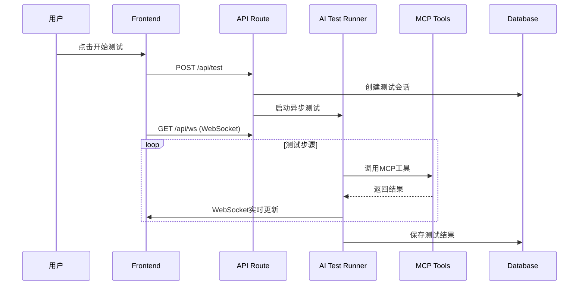

# AI 自动化测试平台 - 架构文档
## 📁 项目结构（现代 Next.js 16 App Router）

```
├── app/                              # 核心路由目录（App Router）
│   ├── api/                          # API routes（Route Handlers）
│   │   ├── test/                      # 测试相关API
│   │   │   ├── route.ts               # POST /api/test - 启动测试
│   │   │   ├── pause/route.ts         # POST /api/test/pause - 暂停测试
│   │   │   └── stop/route.ts         # POST /api/test/stop - 停止测试
│   │   └── ws/                       # WebSocket API
│   │       └── route.ts               # GET /api/ws - WebSocket连接
│   ├── globals.css                    # 全局样式
│   ├── layout.tsx                     # 根布局
│   └── page.tsx                       # 主页面（测试控制台）
├── components/                        # 可复用 UI/组件
│   ├── ui/                           # 基础UI组件
│   │   ├── ControlPanel.tsx           # 控制面板组件
│   │   ├── PlaywrightTestRunner.tsx   # 浏览器预览组件
│   │   ├── SystemLogs.tsx             # 系统日志组件
│   │   └── TestTimeline.tsx           # 测试时间轴组件
│   └── dashboard/                     # 仪表板相关组件（预留）
├── hooks/                            # 自定义 React Hooks
│   └── useWebSocket.ts                # WebSocket连接Hook
├── lib/                              # 工具、数据库连接、Server Actions
│   ├── aiTestRunner.ts                # AI测试运行器
│   ├── db.ts                         # 数据库连接和初始化
│   └── logger.ts                      # 日志系统
├── utils/                            # 通用工具
│   └── testSession.ts                # 测试会话管理
├── types/                            # TypeScript 类型定义
│   └── test.ts                       # 测试相关类型
├── design/                           # 设计图，原型图
│   ├── code.html                      # UI设计参考代码
│   └── screen.png                     # UI设计截图
├── database/                         # 数据库文件目录
├── logs/                             # 日志目录
├── public/                           # 静态资源
├── scripts/                          # 构建和部署脚本
│   └── setup.js                      # 项目初始化脚本
├── .env.local                        # 环境变量配置
├── .env.local.example                 # 环境变量模板
├── .gitignore                        # Git忽略文件
├── next.config.js                     # Next.js配置
├── package.json                       # 项目依赖和脚本
├── README.md                         # 项目说明文档
├── tailwind.config.js                 # Tailwind CSS配置
├── tsconfig.json                     # TypeScript配置
└── postcss.config.js                 # PostCSS配置
```

## 🏗️ 架构设计

### 1. 前端架构（Client-Side）

#### 主页面（app/page.tsx）
- **状态管理**：使用React useState管理测试状态
- **实时通信**：通过WebSocket与后端实时同步
- **组件化**：将UI拆分为可复用的组件

#### 核心组件
- **ControlPanel**：测试配置和控制
- **TestTimeline**：测试步骤时间轴
- **PlaywrightTestRunner**：浏览器实时预览
- **SystemLogs**：系统日志显示

#### 自定义Hooks
- **useWebSocket**：WebSocket连接管理，支持自动重连

### 2. 后端架构（Server-Side）

#### API Routes（App Router）
```
POST /api/test          - 启动新的测试会话
POST /api/test/pause    - 暂停测试会话  
POST /api/test/stop     - 停止测试会话
GET  /api/ws           - WebSocket连接
```

#### 核心模块
- **aiTestRunner.ts**：AI测试流程执行引擎
- **testSession.ts**：测试会话管理
- **db.ts**：SQLite数据库操作
- **logger.ts**：日志记录系统

### 3. 数据流设计

```
用户操作 → Frontend Component → API Route → AI Test Runner → MCP Tools
    ↓                                                      ↓
WebSocket ←←←←←←←←←←←←←←←←←←←←←←←←←←←←←←←←←←←←←←←←
    ↓                                                      ↓
Real-time Updates → UI Components → 用户界面更新
```

## 🔧 核心功能实现

### 1. 测试流程



### 2. MCP工具集成

支持的MCP工具：
- **sequential-thinking**：逐步思考和决策
- **context7**：文档查询和知识检索
- **playwright**：浏览器自动化操作

### 3. 实时通信

使用WebSocket实现前后端实时通信：
- 测试步骤状态更新
- 系统日志实时推送
- 测试进度同步
- 错误和异常通知

## 📊 数据存储

### 数据库表结构

1. **test_sessions** - 测试会话
   - session_id, url, username, requirement, status, timestamps

2. **test_steps** - 测试步骤
   - session_id, step_id, title, status, duration, log

3. **test_logs** - 系统日志
   - session_id, timestamp, type, message

### 日志系统

- **文件日志**：按会话分文件存储
- **控制台日志**：开发时实时查看
- **数据库日志**：结构化存储

## 🚀 部署和运行

### 开发环境

```bash
# 1. 初始化项目
npm run setup

# 2. 安装依赖
npm install

# 3. 启动开发服务器
npm run dev
```

### 生产环境

```bash
# 1. 构建项目
npm run build

# 2. 启动生产服务器
npm start
```

## 🔒 安全考虑

1. **API密钥管理**：使用环境变量存储敏感信息
2. **CORS配置**：配置跨域访问策略
3. **输入验证**：API请求参数验证
4. **错误处理**：避免敏感信息泄露

## 🔄 扩展性

### 1. 新增MCP工具
在`lib/aiTestRunner.ts`中的`callMCPTool`函数添加新工具调用

### 2. 新增测试步骤
在`testSteps`数组中添加新步骤定义和执行逻辑

### 3. 新增UI组件
在`components/ui/`目录创建新组件，在主页面中导入使用

### 4. 新增API端点
在`app/api/`目录添加新的Route Handler文件

## 📈 性能优化

1. **代码分割**：Next.js自动代码分割
2. **图片优化**：Next.js Image组件
3. **数据库连接池**：SQLite连接复用
4. **WebSocket连接管理**：防止内存泄漏

## 🧪 测试策略

1. **单元测试**：核心工具函数测试
2. **集成测试**：API端点测试
3. **端到端测试**：完整测试流程验证
4. **性能测试**：并发测试会话支持

---

这个架构遵循了现代Next.js 16的最佳实践，使用App Router、TypeScript、Tailwind CSS等技术栈，确保了代码的可维护性和扩展性。
